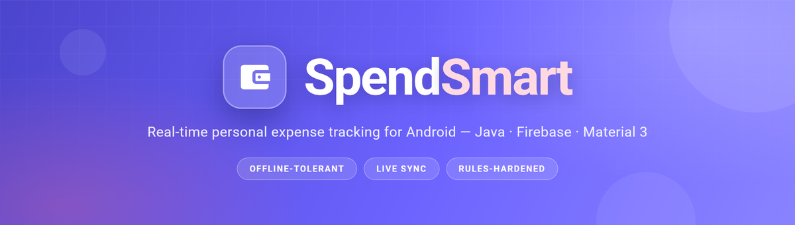
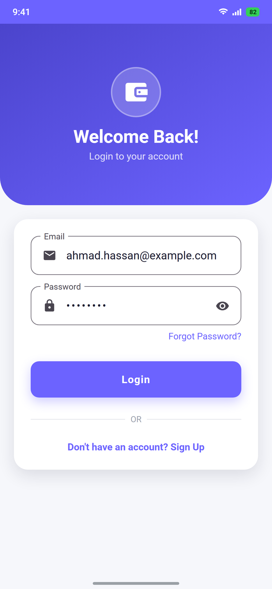
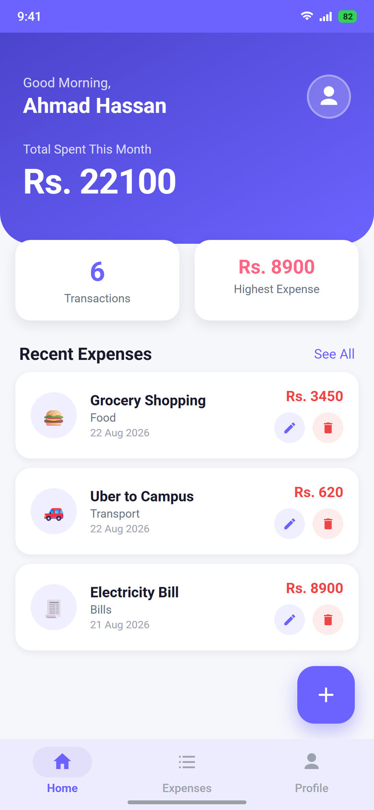
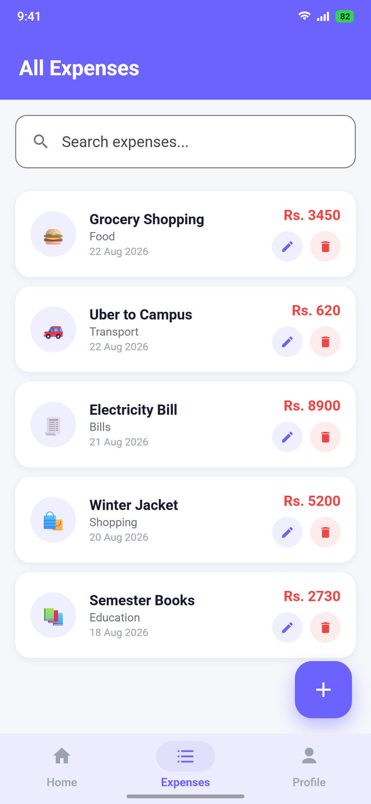
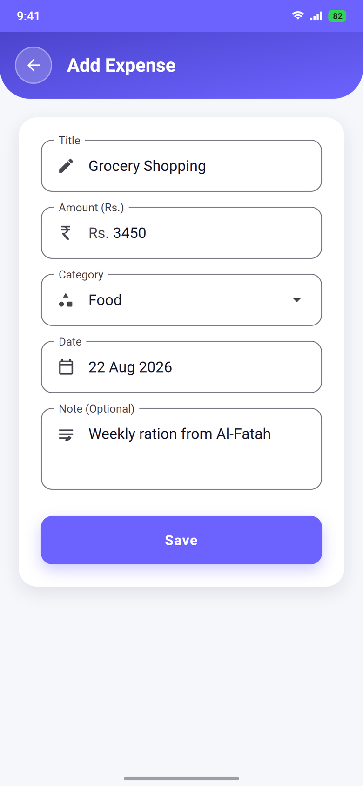
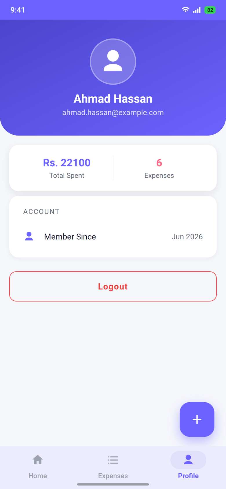
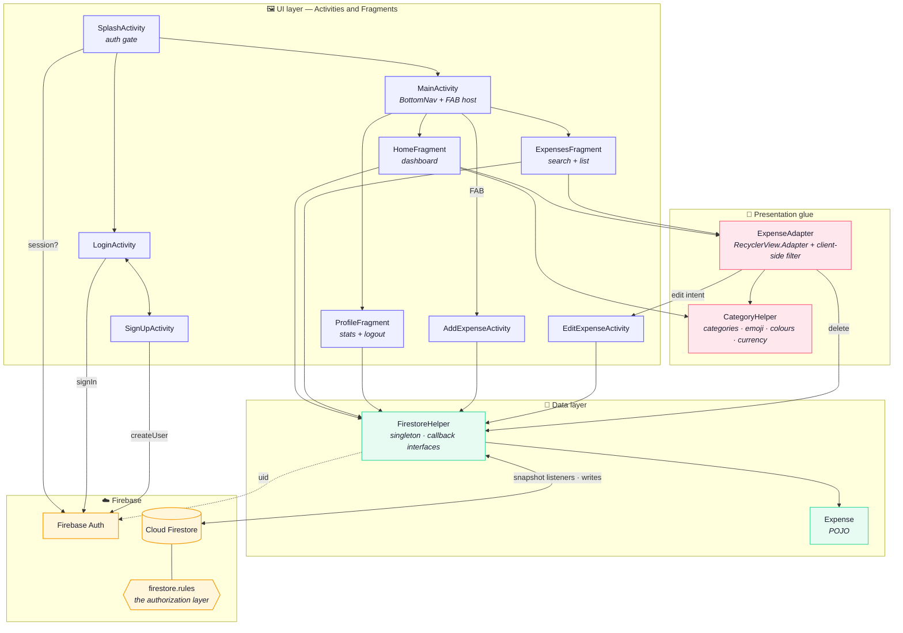
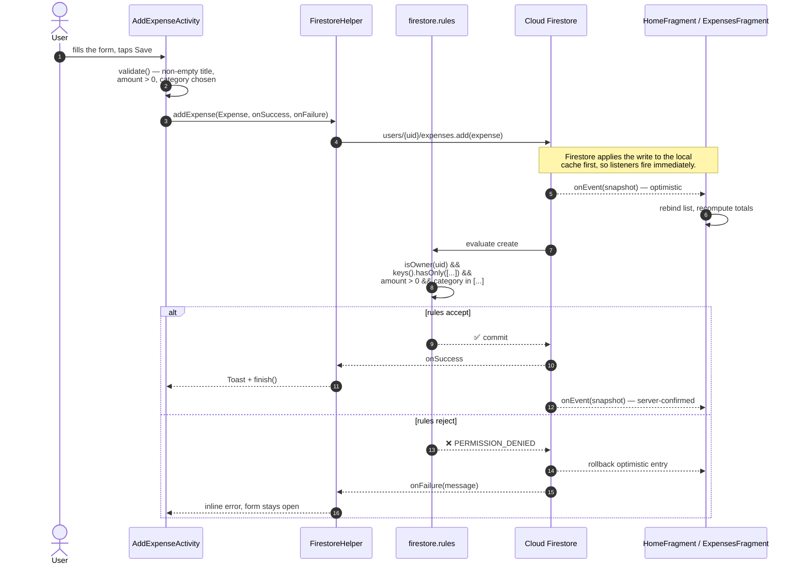
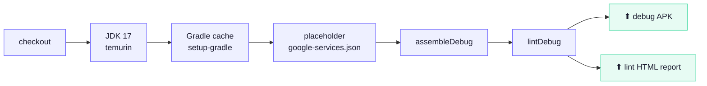

<div align="center">



<br />

**A native Android expense tracker built on Firebase — every edit lands on every signed-in device before the keyboard closes.**

<br />

[](https://github.com/Ahmadhsn1/SpendSmart/actions/workflows/android-ci.yml)
[](https://developer.android.com)
[](https://openjdk.org)
[-6C63FF)](https://developer.android.com/tools/releases/platforms)
[](https://developer.android.com/tools/releases/platforms)
[](https://firebase.google.com)
[](https://m3.material.io)
[](LICENSE)

</div>

---

## Contents

- [What it is](#what-it-is)
- [Screens](#screens)
- [Feature matrix](#feature-matrix)
- [Architecture](#architecture)
- [How a write travels](#how-a-write-travels)
- [Data model](#data-model)
- [Security model](#security-model)
- [Design system](#design-system)
- [Project layout](#project-layout)
- [Getting started](#getting-started)
- [Build, lint, CI](#build-lint-ci)
- [Engineering notes](#engineering-notes)
- [Roadmap](#roadmap)
- [Tech stack](#tech-stack)
- [Contributing](#contributing)
- [License](#license)

---

## What it is

SpendSmart is a personal-finance tracker for Android. You log what you spent, tag it
with a category, and the dashboard keeps a running picture of where the money went.

The interesting part is not the CRUD — it is that there is **no backend server**. The app
talks to Cloud Firestore directly over an authenticated channel, which means two things:

1. **Reads are live, not fetched.** Every list in the app is bound to a Firestore
   `addSnapshotListener`. Delete a row on your tablet and it disappears from your phone's
   list without a pull-to-refresh, a poll, or a manual `notifyDataSetChanged()` from a
   network callback.
2. **Authorization has to be airtight.** With no middle tier, [`firestore.rules`](firestore.rules)
   *is* the security boundary. It is written as a whitelist: schema-validated writes,
   owner-only reads, and a catch-all `allow read, write: if false` at the bottom. A patched
   APK cannot read another user's spending, and cannot store a negative amount or a
   category the app does not define.

Written in **plain Java 8** against the AndroidX/Material 3 stack — no Kotlin, no DI
framework, no reactive library. The dependency block is eight lines long, and every one of
them is used.

---

## Screens

<div align="center">

| Login | Dashboard | All Expenses |
| :---: | :---: | :---: |
|  |  |  |
| Material 3 outlined fields, inline validation, password reveal toggle | Time-aware greeting, live totals, five most recent rows | Instant client-side search across title **and** category |

| Add Expense | Profile |
| :---: | :---: |
|  |  |
| Rupee-prefixed amount field, category dropdown, native date picker | Aggregate stats, `Member Since` from the Firebase Auth token |

</div>

---

## Feature matrix

| | Feature | How it works |
| :--- | :--- | :--- |
| 🔐 | **Email / password auth** | Firebase Auth. `SplashActivity` reads `FirebaseAuth.getCurrentUser()` and routes to `MainActivity` or `LoginActivity`, so a returning user never sees a login form. |
| ✍️ | **Full CRUD on expenses** | `FirestoreHelper` exposes `addExpense` / `listenToExpenses` / `updateExpense` / `deleteExpense`. Updates are sent as a field map, so a partial edit never clobbers the document. |
| ⚡ | **Real-time sync** | Both list screens attach a snapshot listener ordered by `timestamp DESC`. Firestore replays local writes optimistically, then reconciles with the server. |
| 📊 | **Live dashboard stats** | Total spent, transaction count and highest single expense are folded from the full expense stream, not stored as denormalised counters that can drift. |
| 🔎 | **Search** | `ExpenseAdapter.filter()` keeps an unfiltered backing list (`expenseListFull`) and matches case-insensitively against title *and* category. Zero network round-trips per keystroke. |
| 🗂️ | **Seven categories** | `CategoryHelper` holds the single source of truth: a static `ArrayList` for the dropdown plus `HashMap`s for the emoji and the accent colour. The same seven strings are re-validated server-side in the rules. |
| 🗑️ | **Guarded delete** | `MaterialAlertDialogBuilder` confirmation before the Firestore delete — no silent destructive taps. |
| 📅 | **Native date picker** | The date field is `focusable="false"` and opens a `DatePickerDialog`, so the soft keyboard never fights the dialog. |
| 🈳 | **Real empty states** | Every list has a designed empty state (wallet glyph, headline, hint) instead of a blank screen. |
| 🎨 | **Material 3 throughout** | Themed `TextInputLayout`s, `MaterialButton` styles, pill-indicator `BottomNavigationView`, and a light navigation bar layered in at API 27+. |
| 🌍 | **RTL-ready** | `supportsRtl="true"`, and layouts use `Start`/`End` padding rather than `Left`/`Right`. |

---

## Architecture

A deliberately flat, three-tier structure. Views own their own state, one helper owns all
I/O, and the model is a plain Java bean that Firestore can hydrate reflectively.



**Why a singleton for the data layer.** `FirestoreHelper` resolves the signed-in UID once
in its private constructor and derives every collection path from it, so no call site can
accidentally address another user's subtree. `FirestoreHelper.reset()` is called on logout
to drop the cached UID — without that, the next user to sign in on the same device would
inherit the previous one's paths.

---

## How a write travels

Saving an expense from a cold form to three synchronised screens:



The optimistic-then-reconcile path is why the app feels instant on a slow connection: the
UI is driven by the local cache, and the server is a second opinion that arrives later.

---

## Data model

Expenses live in a **subcollection under the owning user**, never in a flat top-level
collection with a `userId` field. That choice does the heavy lifting for security: the
rules can authorise on the *path* rather than on a document field, so there is no query
that can even name another user's data.

```
users/{uid}                                  ← profile document
├── name        : string        "Ahmad Hassan"
├── email       : string        "ahmad.hassan@example.com"
├── createdAt   : number        1750000000000        (epoch ms, written once)
│
└── expenses/{expenseId}                     ← subcollection, auto-ID
    ├── title      : string     "Grocery Shopping"
    ├── amount     : number     3450.0
    ├── category   : string     one of the seven known categories
    ├── date       : string     "22 Aug 2026"        (display form)
    ├── note       : string     "Weekly ration from Al-Fatah"   (optional)
    └── timestamp  : number     1755820800000        (epoch ms, sort key)
```

| Field | Why it looks like that |
| :--- | :--- |
| `amount` as `number` | Firestore doubles, formatted at the edge by `CategoryHelper.formatAmount()`, which drops the decimals when the value is whole (`Rs. 3450`, not `Rs. 3450.00`). |
| `date` **and** `timestamp` | `date` is the human string the user picked and is what gets rendered; `timestamp` is the stable machine sort key every query orders by. The rules pin `timestamp` on update so an edit can never reshuffle history. |
| `category` as a string | Kept as the display label so it round-trips with `CategoryHelper` and stays readable in the Firebase console. The valid set is enforced in the rules, not just in the picker. |
| Auto-ID document keys | The app never invents IDs. `doc.getId()` is copied into the POJO's transient `id` after read, which is what edit and delete address. |

> `Expense` is a textbook Firestore bean: no-arg constructor for deserialisation, a
> parameterised constructor for the app, private fields with getters/setters. `id` is set
> from the snapshot rather than stored in the document, so it is never duplicated.

---

## Security model

Everything in this database is private financial history, and the client SDK reaches it
directly. [`firestore.rules`](firestore.rules) therefore does four jobs:

| Guarantee | Rule |
| :--- | :--- |
| **Ownership** | `isOwner(userId)` on every match block — `request.auth.uid` must equal the path segment. |
| **Schema closure** | `request.resource.data.keys().hasOnly([...])` — a patched client cannot add fields the app does not know about. |
| **Value sanity** | `amount is number && amount > 0 && amount <= 1e9`, `title.size() <= 120`, `category in [...]`. |
| **Immutability** | `email` and `createdAt` cannot be rewritten after sign-up; `timestamp` cannot be moved by an update. |
| **Default deny** | A trailing `match /{document=**} { allow read, write: if false; }` so any collection added later is closed until it is explicitly opened. |

Deploy them with:

```bash
firebase deploy --only firestore:rules
```

**Firestore also needs a composite-free index only** — every query is a single-field
`orderBy("timestamp")`, which Firestore serves from the automatic index. No `firestore.indexes.json`
is required.

### What is *not* in this repository

`app/google-services.json` is git-ignored. It carries your Firebase project number, app ID
and Android API key — not secret in the cryptographic sense, but it is project *identity*,
and a public repo should not hand it out. [`app/google-services.json.example`](app/google-services.json.example)
documents the exact shape to drop in; see [Getting started](#getting-started).

---

## Design system

Not ad-hoc colours sprinkled through layouts — a token set in
[`colors.xml`](app/src/main/res/values/colors.xml) and
[`dimens.xml`](app/src/main/res/values/dimens.xml) that every screen draws from.

### Brand

| Token | Swatch | Role |
| :--- | :--- | :--- |
| `primary` |  | Brand indigo — headers, FAB, active nav, primary buttons |
| `primary_dark` |  | Gradient terminus at 135° |
| `primary_light` |  | Category-icon bubbles, pressed states |
| `secondary` |  | Coral accent — highest-expense stat |
| `accent` |  | Positive / mint accent |

### Surfaces & text

| Token | Swatch | Role |
| :--- | :--- | :--- |
| `background` |  | App canvas |
| `surface` |  | Cards, sheets, inputs |
| `surface_variant` |  | Recessed rows |
| `text_primary` |  | Headings, values |
| `text_secondary` |  | Labels, captions |
| `text_hint` |  | Placeholders, inactive nav |
| `divider` |  | Hairlines between rows |
| `border` |  | Input outlines |

### Semantic & category

| Token | Swatch | | Category | Token | Swatch |
| :--- | :--- | :-- | :--- | :--- | :--- |
| `success` |  | | 🍔 Food | `cat_food` |  |
| `error` |  | | 🚗 Transport | `cat_transport` |  |
| `warning` |  | | 🛍️ Shopping | `cat_shopping` |  |
| | | | 🧾 Bills | `cat_bills` |  |
| | | | 💊 Health | `cat_health` |  |
| | | | 📚 Education | `cat_education` |  |
| | | | 💰 Other | `cat_other` |  |

### Scale

| Spacing | | Radius | | Type | | Component | |
| :--- | :-- | :--- | :-- | :--- | :-- | :--- | :-- |
| `xs` | 4dp | `sm` | 8dp | `xs`–`sm` | 10 / 12sp | `button_height` | 52dp |
| `sm` | 8dp | `md` | 12dp | `md`–`base` | 14 / 15sp | `input_height` | 56dp |
| `md` | 16dp | `lg` | 16dp | `lg`–`xl` | 16 / 18sp | `icon_sm`–`xl` | 20 → 48dp |
| `lg` | 24dp | `xl` | 24dp | `2xl`–`3xl` | 20 / 24sp | `avatar_size` | 48dp |
| `xl` | 32dp | `full` | 100dp | `4xl`–`5xl` | 28 / 32sp | `fab_margin` | 20dp |

The gradient in [`bg_header.xml`](app/src/main/res/drawable/bg_header.xml) and
[`bg_auth_top.xml`](app/src/main/res/drawable/bg_auth_top.xml) is the same 135° indigo
ramp, differing only in corner radius (32dp on the dashboard, 40dp on the auth screens) —
which is what makes the whole app read as one surface.

---

## Project layout

```
SpendSmart/
├── app/
│   ├── build.gradle                      # module config · 8 dependencies, all used
│   ├── google-services.json.example      # template — copy, fill, rename
│   ├── proguard-rules.pro
│   └── src/main/
│       ├── AndroidManifest.xml           # 6 activities, portrait-locked, adjustResize
│       ├── java/com/spendsmart/
│       │   ├── activities/
│       │   │   ├── SplashActivity.java       # session gate → Main or Login
│       │   │   ├── LoginActivity.java        # Firebase Auth sign-in + validation
│       │   │   ├── SignUpActivity.java       # create user, then write profile doc
│       │   │   ├── MainActivity.java         # BottomNav host + FAB
│       │   │   ├── AddExpenseActivity.java   # create form, date picker, dropdown
│       │   │   └── EditExpenseActivity.java  # pre-filled update form
│       │   ├── fragments/
│       │   │   ├── HomeFragment.java         # greeting, live totals, recent 5
│       │   │   ├── ExpensesFragment.java     # full list + search
│       │   │   └── ProfileFragment.java      # aggregates, member-since, logout
│       │   ├── adapters/
│       │   │   └── ExpenseAdapter.java       # RecyclerView + filter + row actions
│       │   ├── helpers/
│       │   │   ├── FirestoreHelper.java      # singleton data layer, all Firestore I/O
│       │   │   └── CategoryHelper.java       # categories, emoji, colours, currency
│       │   └── models/
│       │       └── Expense.java              # Firestore-friendly POJO
│       └── res/
│           ├── layout/                   # 10 layouts (6 screens, 3 tabs, 1 row)
│           ├── drawable/                 # 16 vector icons + 8 shape/gradient backgrounds
│           ├── values/                   # colors · dimens · strings · themes
│           ├── values-v27/themes.xml     # windowLightNavigationBar (API 27+)
│           └── menu/bottom_nav_menu.xml
│
├── docs/
│   ├── banner.png
│   └── screenshots/                      # the five screens above
│
├── .github/
│   ├── workflows/android-ci.yml          # assemble + lint on every push and PR
│   ├── ISSUE_TEMPLATE/                   # bug · feature · security redirect
│   ├── PULL_REQUEST_TEMPLATE.md
│   ├── CONTRIBUTING.md
│   └── dependabot.yml                    # weekly Gradle + Actions updates
│
├── firestore.rules                       # the authorization layer
├── SECURITY.md · CHANGELOG.md · LICENSE
├── .editorconfig · .gitattributes · .gitignore
└── build.gradle · settings.gradle · gradle.properties · gradlew
```

---

## Getting started

### Prerequisites

| | Version |
| :--- | :--- |
| Android Studio | Hedgehog (2023.1.1) or newer |
| JDK | 17 — the JBR bundled with Android Studio is fine |
| Android SDK | Platform 34 + Build-Tools 34 |
| A Firebase project | Free Spark tier is enough |

### 1 — Clone

```bash
git clone https://github.com/Ahmadhsn1/SpendSmart.git
cd SpendSmart
```

### 2 — Create the Firebase project

In the [Firebase console](https://console.firebase.google.com):

1. **Add project** → give it any name.
2. **Build → Authentication → Get started → Email/Password → Enable.**
3. **Build → Firestore Database → Create database.** Pick a region, start in
   *production mode* (the rules in this repo replace the default ones anyway).
4. **Project settings → Your apps → Add app → Android.**
   Package name **must** be `com.spendsmart` — it is the `applicationId` in
   [`app/build.gradle`](app/build.gradle).
5. Download the generated `google-services.json`.

### 3 — Drop in your config

```bash
# from the repo root
cp ~/Downloads/google-services.json app/google-services.json
```

The file is git-ignored, so it will not be committed back.
If you want to see the expected shape first, look at
[`app/google-services.json.example`](app/google-services.json.example).

### 4 — Publish the security rules

```bash
npm install -g firebase-tools
firebase login
firebase use --add                       # select the project you just created
firebase deploy --only firestore:rules
```

Skipping this step leaves the console's default rules in place, and the app will fail
its first write with `PERMISSION_DENIED` — which is the rules doing their job.

### 5 — Build and run

```bash
./gradlew assembleDebug                   # macOS / Linux
gradlew.bat assembleDebug                 # Windows cmd
```

The APK lands at `app/build/outputs/apk/debug/app-debug.apk`. To install on a connected
device:

```bash
./gradlew installDebug
```

<details>
<summary><b>Windows / Git Bash: <code>JAVA_HOME is not set</code></b></summary>

Point Gradle at the JetBrains Runtime that ships with Android Studio:

```bash
JAVA_HOME="/c/Program Files/Android/Android Studio/jbr" ./gradlew assembleDebug
```

</details>

<details>
<summary><b><code>File google-services.json is missing</code></b></summary>

The `com.google.gms.google-services` Gradle plugin needs a real config at
`app/google-services.json`. Complete step&nbsp;3. To only verify that the project
*compiles*, the placeholder is enough:

```bash
cp app/google-services.json.example app/google-services.json
```

It points at no real Firebase project, so the app will build but not sign in — which is
exactly what CI does.

</details>

---

## Build, lint, CI

[`.github/workflows/android-ci.yml`](.github/workflows/android-ci.yml) runs on every push
and pull request to `main`:



CI never sees a real Firebase project. It synthesises the placeholder config from
`google-services.json.example` so the `google-services` plugin can resolve and the
compile step is genuinely verified, while nothing in the pipeline can reach production
data. Both the APK and the lint report are uploaded as artifacts on every run.

Locally:

```bash
./gradlew assembleDebug     # compile + package
./gradlew lintDebug         # Android Lint — the build fails on any lint *error*
./gradlew clean             # wipe build outputs
```

`lintDebug` is clean at the error level. Report:
`app/build/reports/lint-results-debug.html`.

---

## Engineering notes

A few decisions worth calling out, because they are the ones a reviewer would ask about.

<details>
<summary><b>Why the adapter filters in memory instead of re-querying</b></summary>

Firestore has no `LIKE`. A server-side substring search means either fetching everything
anyway or bolting on a search service. Since one user's expense history is small and is
*already* in memory behind the snapshot listener, `ExpenseAdapter.filter()` matches
against a retained `expenseListFull` copy. Every keystroke costs zero reads — which also
means zero Firestore billing on search.

</details>

<details>
<summary><b>Why two listeners on the dashboard</b></summary>

`HomeFragment` attaches `listenToRecentExpenses()` (`limit(5)`) for the list, and
`listenToExpenses()` for the aggregates. Splitting them keeps the visible list cheap while
still letting totals reflect the full history. The alternative — one unbounded listener
plus a client-side `subList(0, 5)` — would download everything just to draw five rows.

</details>

<details>
<summary><b>Why <code>updateExpense</code> sends a map, not the whole object</b></summary>

`update()` with an explicit field map touches only the five editable keys. `set()` with a
rebuilt `Expense` would rewrite `timestamp` too — and since `timestamp` is the sort key,
editing a note would silently jump the row to the top of the list. The rules enforce the
same invariant server-side.

</details>

<details>
<summary><b>Why <code>FirestoreHelper.reset()</code> exists</b></summary>

The singleton caches the UID resolved in its constructor. Log out and log in as someone
else on the same device and a stale instance would keep writing to the previous user's
subtree. `ProfileFragment` calls `reset()` alongside `FirebaseAuth.signOut()`, so the next
`getInstance()` re-resolves against the new session.

</details>

<details>
<summary><b>Why <code>values-v27/</code> exists instead of a lint suppression</b></summary>

`android:windowLightNavigationBar` arrived in API 27; `minSdk` is 24. Rather than
`tools:targetApi` — which silences the warning but still ships the attribute to devices
that cannot resolve it — the base theme lives in `values/` and the flag is layered on in
`values-v27/`. The resource system picks the right variant per device, and lint is happy
without being told to look away.

</details>

<details>
<summary><b>Currency formatting is deliberately not <code>NumberFormat</code></b></summary>

`CategoryHelper.formatAmount()` emits `Rs. 3450` — no thousands separator, no decimals on
whole values. That is a conscious v1 choice to keep the dashboard's 36sp figure from
wrapping on narrow screens, and it is flagged in the [roadmap](#roadmap) as the thing to
replace with a locale-aware formatter.

</details>

---

## Roadmap

Known gaps, stated plainly rather than papered over.

- [ ] **Month-scope the dashboard total.** `HomeFragment` labels the hero figure
      *Total Spent This Month* but currently sums the entire history. Needs a
      `whereGreaterThanOrEqualTo("timestamp", startOfMonth)` bound — and the label and the
      query should be driven by the same value so they cannot drift again.
- [ ] **Locale-aware currency.** Replace the hand-rolled `Rs. ` prefix with
      `NumberFormat.getCurrencyInstance()` plus a user-selectable currency, so the app is
      not implicitly PKR-only.
- [ ] **Category breakdown chart.** A donut of spend-by-category on the dashboard, built
      from the aggregate listener that is already running.
- [ ] **Budgets and alerts.** Per-category monthly caps with a local notification at 80%.
- [ ] **Recurring expenses.** Rent and subscriptions auto-inserted on a schedule.
- [ ] **CSV / PDF export.** Share a date-ranged statement out of the app.
- [ ] **Dark theme.** The token set is already centralised; this is a `values-night/`
      colour swap plus icon-tint review.
- [ ] **Unit + instrumentation tests.** `CategoryHelper` and `ExpenseAdapter.filter()` are
      pure and immediately testable; `FirestoreHelper` is worth covering against the
      Firebase Emulator Suite, which would also let CI assert `firestore.rules` directly.
- [ ] **Detach listeners in `onDestroyView`.** `addSnapshotListener` returns a
      `ListenerRegistration` that the fragments currently drop. The `isAdded()` guards keep
      it correct today, but holding and removing the registration is the right lifecycle
      hygiene.

---

## Tech stack

| Layer | Choice | Version |
| :--- | :--- | :--- |
| Language | Java | 8 (`sourceCompatibility 1.8`) |
| Build | Gradle (Groovy DSL) · Android Gradle Plugin | 8.2.1 · 8.2.2 |
| SDK | `compileSdk` / `targetSdk` / `minSdk` | 34 / 34 / 24 |
| UI toolkit | Android Views + `viewBinding` | — |
| Design | Material Components for Android | 1.11.0 |
| Compat | AppCompat · ConstraintLayout · RecyclerView · CardView | 1.6.1 · 2.1.4 · 1.3.2 · 1.0.0 |
| Auth | Firebase Authentication (email/password) | via BOM 32.7.2 |
| Database | Cloud Firestore (real-time listeners) | via BOM 32.7.2 |
| Authorization | Firestore Security Rules v2 | — |
| CI | GitHub Actions · JDK 17 (Temurin) | — |

---

## Contributing

Issues and pull requests are welcome — see [CONTRIBUTING.md](.github/CONTRIBUTING.md) for the
branch naming, commit style, and the checks a PR is expected to pass. Security-relevant
reports go through [SECURITY.md](SECURITY.md) instead of the public issue tracker.

---

## License

[MIT](LICENSE) © Ahmad Hassan

<div align="center">
<br />
<sub>Built with Java, Firebase, and an unreasonable amount of attention to 4dp increments.</sub>
</div>
